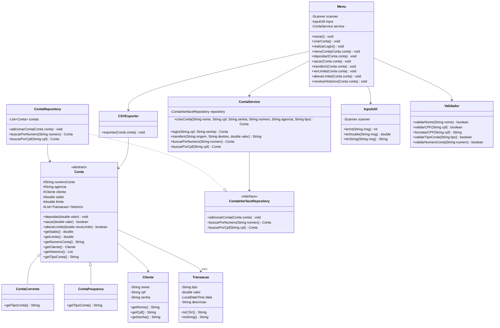
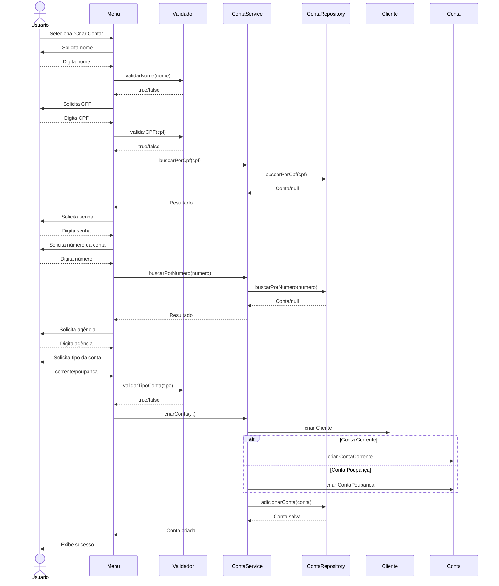
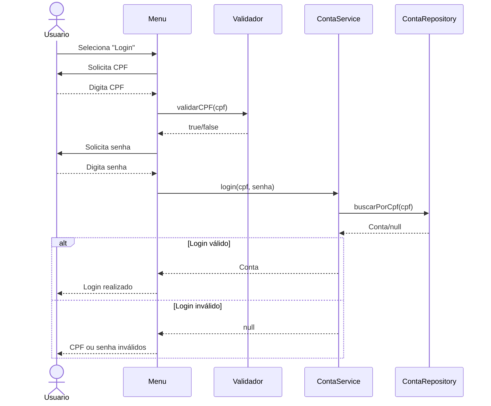
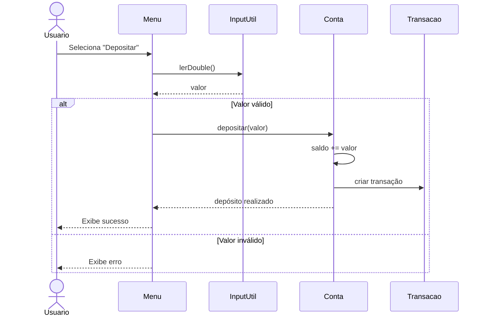
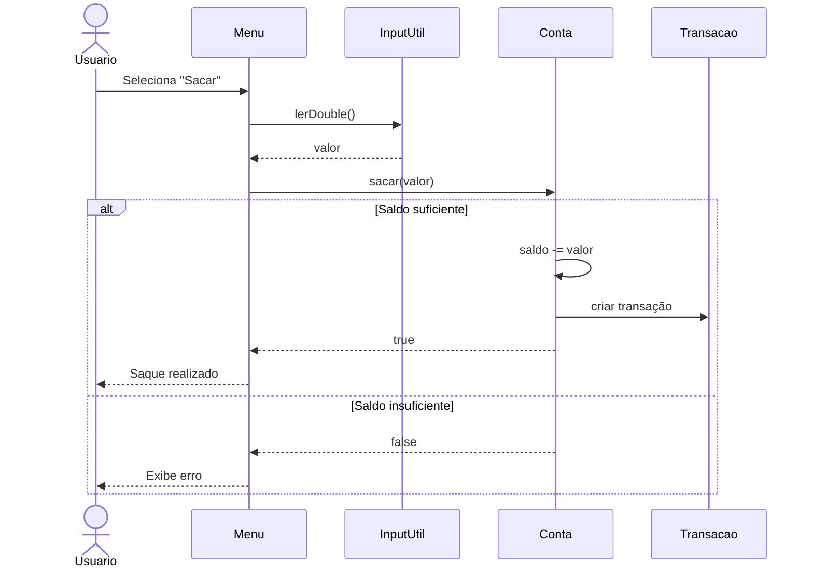
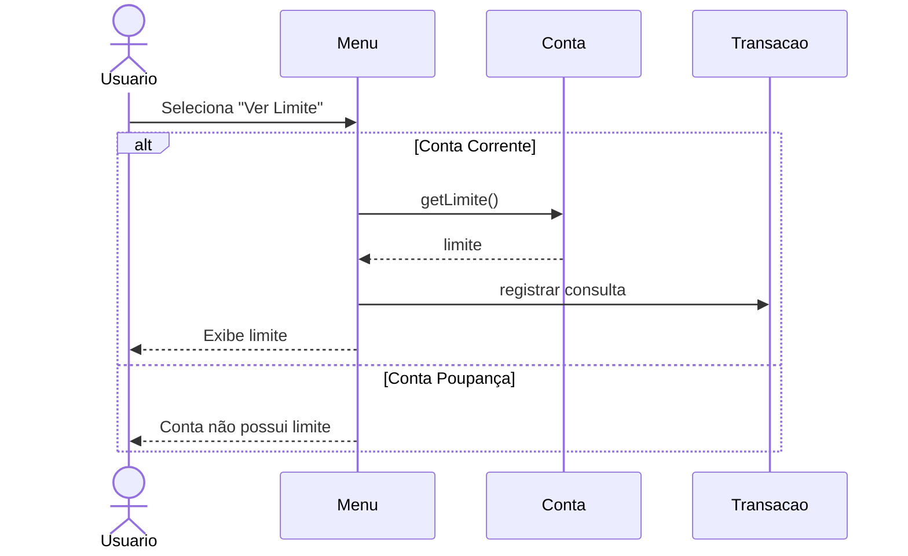
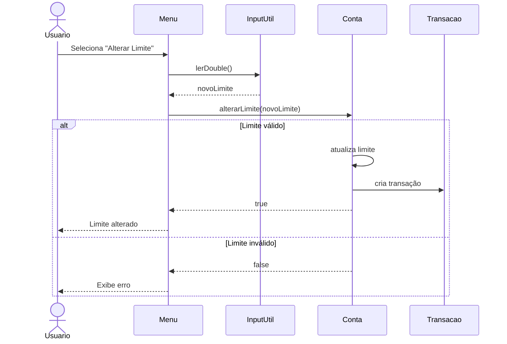
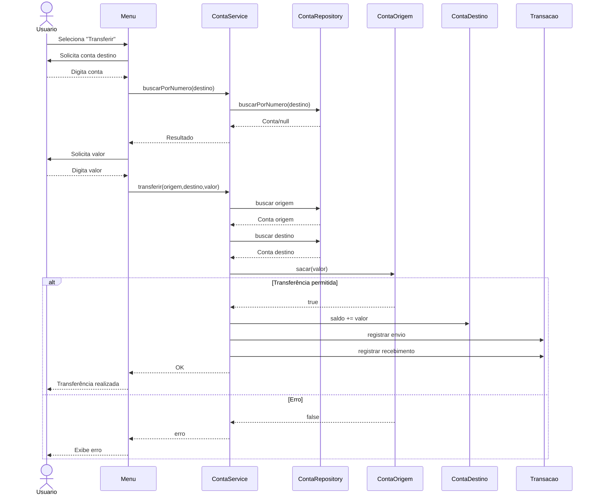
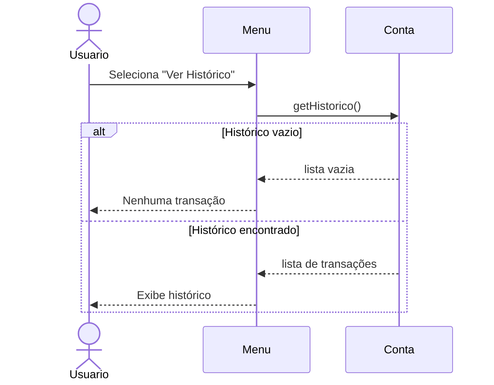
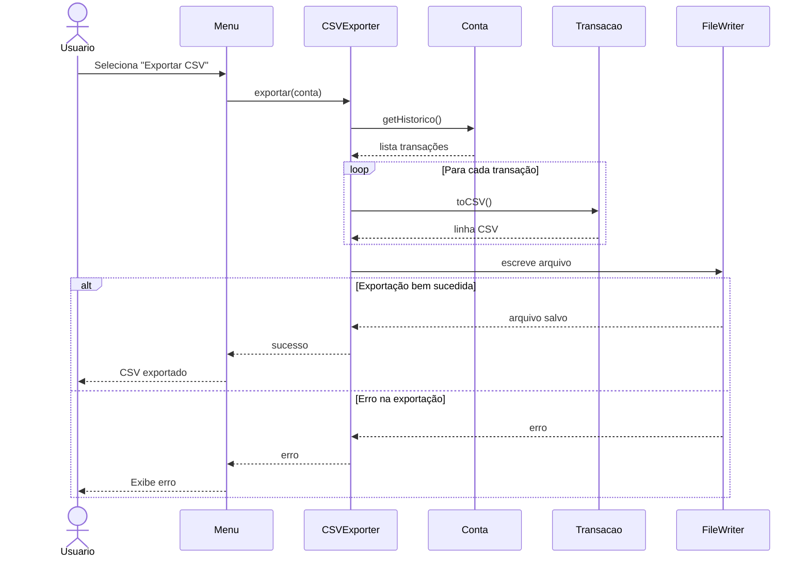

# aplicacao_bancaria
Sistema bancário em Java utilizando console


## Sobre o Projeto - 🚧 Em Desenvolvimento 🚧

Este projeto consiste em um sistema bancário desenvolvido em Java utilizando os conceitos de Programação Orientada a Objetos (POO). 
A aplicação funciona via terminal/console e permite operações bancárias básicas como:

* Criação de contas
* Login de usuários
* Depósitos
* Saques
* Transferências
* Controle de limite
* Histórico de transações
* Exportação de histórico em CSV

---

## Sumário

- [Estrutura do Projeto](#estrutura-do-projeto)
- [Funcionalidades](#funcionalidades)
- [Segurança e Regras de Negócio](#segurança-e-regras-de-negócio)
- [Conceitos de POO Aplicados](#conceitos-de-poo-aplicados)
- [Guia de Execução do Projeto](#guia-de-execução-do-projeto)
- [Fluxo de Operação da Aplicação](#fluxo-de-operação-da-aplicação)
- [Diagramação do Sistema](#diagramação-do-sistema)
  - [Diagrama de Classe](#1-diagrama-de-classe)
  - [Diagramas de Sequência](#2-diagrama-de-sequência)

---

## Estrutura do Projeto
O sistema foi estruturado seguindo a `arquitetura MVC`, onde cada camada tem sua responsabilidade:

### 1. Model - com.aplicacao_bancaria.model

A camada `Model` representa as entidades do sistema.
Ela é responsável por armazenar os dados e comportamentos principais das contas, clientes e transações.

#### Exemplos:

* Cliente (Cliente.java);
* Conta (Conta.java);
* Conta Corrente (ContaCorrente.java);
* Conta Poupanca (ContaPoupanca.java);
* Transação (Transacao.java);

Essa camada contém:

* Atributos 
* Construtores
* Getters
* Regras básicas da entidade

### 2. Repository - com.aplicacao_bancaria.repository

A camada `Repository` é responsável pelo armazenamento e busca de dados.
Atualmente o sistema utiliza armazenamento em memória através de listas (ArrayList).

#### Ela realiza operações como:

* Adicionar contas (adicionarConta);
* Buscar contas por CPF (buscarPorCpf);
* Buscar contas por número (buscarPorNumero);

Além disso, utiliza uma interface (ContaInterfaceRepository) para reduzir o acoplamento entre o Service e a implementação concreta do repositório.

### 3. Service - com.aplicacao_bancaria.service

A camada `Service` contém as regras de negócio do sistema.
#### Ela é responsável por:

* Criação de contas (ContaService)
* Login
* Transferências
* Validações de regras bancárias
* Limite noturno
* Validações de saldo

Essa camada funciona como intermediária entre a interface do usuário e os dados.

### 4. UI - com.aplicacao_bancaria.ui

A camada `UI` (User Interface) é responsável pela interação com o usuário. Ela exibe menus, recebe entradas e mostra mensagens no console.

#### Exemplos:

* Menu de login/criação de conta
* Menu principal
* Opções bancárias
* Mensagens de erro

### 5. Util - com.aplicacao_bancaria.util

A camada `util` contém classes utilitárias reutilizáveis.
Ela centraliza funcionalidades auxiliares utilizadas em várias partes do sistema, evitando a repetição de código e melhorando a organização do projeto.

#### Exemplos:

* Validações
* Leitura segura de dados
* Exportação CSV (com caminho peronalizado)
* Formatação

---

## Funcionalidades
### Conta
* Cadastro de conta corrente
* Cadastro de conta poupança
* Validação de CPF
* Validação de nome
* Validação de número da conta
* Login

### Operações Bancárias
* Ver saldo
* Depositar
* Sacar
* Transferir
* Consultar limite
* Alterar limite
* Consultar histórico
* Exportar histórico

---

## Segurança e Regras de Negócio

### Limite Noturno

O sistema possui restrições para transferências em horários específicos:

| Horário  | Regra                     |
| -------- | ------------------------- |
| Até 20h  | Transferências livres     |
| Após 20h | Máximo de R$1000          |
| Após 22h | Transferências bloqueadas |

### Histórico

Todas as operações são registradas e formatadas para consulta:

* Depósitos
* Saques
* Transferências
* Alterações de limite
* Consultas de limite

### Exportação CSV

O usuário pode exportar o histórico da conta em formato `CSV`.
O arquivo é exportado automaticamente para a pasta Downloads do usuário contendo todas as transações realizadas na conta. 
O caminho é personalizável a partir do:

```text
Downloads/
```
---

## Conceitos de POO Aplicados

### Encapsulamento

Os atributos das classes são privados/protected e acessados através de métodos.

### Herança

A classe abstrata `Conta` é herdada por:

* ContaCorrente
* ContaPoupanca

### Polimorfismo

Utilização de métodos abstratos e interfaces.

### Interface

A interface `ContaInterfaceRepository` desacopla o service da implementação concreta do repositório.

### Baixo Acoplamento e  Alta Coesão

As responsabilidades foram separadas para que cada classe possua uma função específica dentro do sistema.

---

## Guia de Execução do Projeto

### Pré-requisitos

* Java JDK 17+ instalado
* Eclipse IDE (ou outra IDE Java)
* Git e SpringTools instalado

### Clonar o Repositório

```bash
git clone https://github.com/BottoYA/aplicaco_bancaria.git
```

### Abrir no Eclipse

1. Abra o Eclipse
2. Clique em:

```text
File → Open Projects from File System
```

3. Selecione a pasta do projeto e clique em Finish

### Inicializar Sistema

Localize a classe:

```text
Main.java
```

Depois:

```text
Botão direito → Run As → Java Application
```

### Fluxo de Operação da Aplicação

#### 1. Menu Inicial

Ao inicializar a aplicação, teremos as seguintes opções:

```text
1 - Criar conta
2 - Login
0 - Sair
```

Durante o primeiro uso, escolha a opção `1` para criar uma conta.

#### 1.1 Criar Conta

O usuário deverá informar, na seguinte ordem:

* Nome
* CPF
* Senha
* Número da conta
* Agência
* Tipo da conta

O sistema realiza validações a cada etapa antes de criar a conta, para que `não` seja possível:

* Entrar com números no campo `Nome`
* Adicionar um `CPF` com menos/mais de 11 números
* Digitar letras no campo `CPF` e `Número da conta`
* Cadastrar um `CPF` já incluído no sistema
* Digitar qualquer outra entrada a não ser `corrente` ou `poupanca` no campo `Tipo da conta`

Ao realizar a criação da conta, o usuário será mandado de volta ao menu inicial, onde pode criar outra conta ou realizar login.

#### 1.2. Login

O login é realizado utilizando os dados já cadastrados:

* CPF
* Senha

### 2. Menu da Conta

Após o login, será apresentado as opções dentro da conta:

```text
1 - Ver saldo
2 - Depositar
3 - Sacar
4 - Ver limite
5 - Alterar limite
6 - Transferir
7 - Ver histórico
8 - Exportar CSV
0 - Logout
```

As validações feitas nessas etapas são:

#### 2.2. Depósito
* Não aceita letras
* Não aceita valores negativos

#### 2.3. Saque

* Não aceita letras
* Não aceita valores negativos
* Verifica saldo + limite

#### 2.4. e 2.5. Ver/Alterar limite

* Contas do tipo poupança não possuem limite, logo não será possível visualizar nem alterar

#### 2.6. Transferência

* Verifica existência da conta destino
* Não aceita letras
* Não aceita valores negativos
* Possui limite noturno

---

## Diagramação do Sistema
### 1. Diagrama de Classe



### 2. Diagrama de Sequência
#### 2.1. Criar Conta




#### 2.2. Login



#### 2.3. Depositar



#### 2.4. Sacar



#### 2.5. Ver Limite



#### 2.6. Alterar Limite



#### 2.7. Transferir



#### 2.8. Mostrar Histórico



#### 2.9. Exportar CSV


